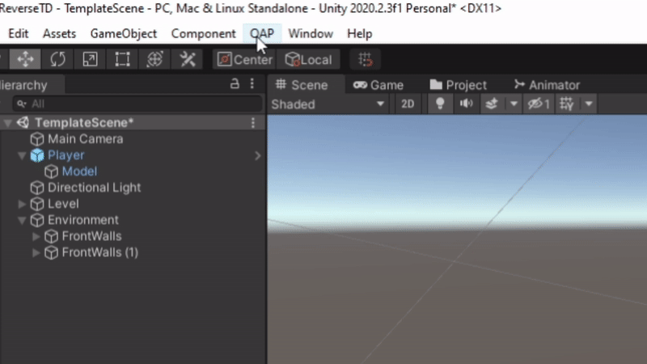
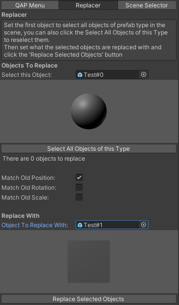
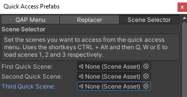
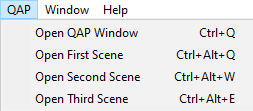
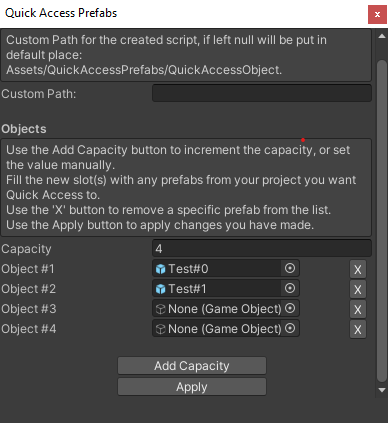

# QuickAccessPrefabs
Used to easily add and replace prefabs using the Unity Quick Access Menu. Property of Poly Fruit Studios Ltd.

## Table of Contents
<details>
<summary>Click to expand</summary>
  
- [Guides](#guides)
  * [Quick Access Prefabs](#quick-access-prefabs-guide)
  * [Replacer](#replacer-guide)
  * [Scene Selector](#scene-selector-guide)
- [How It Works](#how-it-works)
  * [Quick Access Prefabs](#qap_hiw)
    + [Editor Window](#editor-window)
    + [Functionality](#functionality)
  * [Replacer](#replacer-hiw)
    + [Editor Window](#replacer-editor-window)
    + [Functionality](#replacer-functionality)
  * [Scene Selector](#scenes-hiw)
    + [Editor Window](#scenes-editor-window)
    + [Functionality](#scenes-functionality)

</details>

## Guides
### Quick Access Prefabs<a name="quick-access-prefabs-guide"></a>
<p align="center">
<br>
Open up the Window from the QAP -> Prefab List.
From there you can choose how many prefabs you want to add to the list, any empty slots will be ignored.
Use the Add Capacity button to increase the capacity by one.
The ‘X’ button will remove the associated prefab.
</p>
<br>

<p align="center">
<br>
Once all changes are complete, press the Apply button to set the changes and then see the prefabs in the Quick Access Menu or the GameObject menu, 
under the section Create Other.
</p>
<br>
  
<p align="center">
<br>
The tool can be used to add GameObjects and also to replace selected objects. 
This is done using the same method as adding objects but under the ReplaceAll section. 
The selected objects will then be deleted and the new objects will be created in their places.
</p>
<br>
Any changes made in the scene can be undone and then redone in the usual method, using CTRL + (Z/Y) or Edit -> (Undo / Redo) QAP.

### Replacer <a name="replacer-guide"></a>
<p align="center">
<br>
For the Replacer section, you simply select the object you want to be replaced and the object you want to replace it with. You can select/deselect
objects in the scene as well, as only the selected objects will be replaced, and you can select all objects of the type that are in the scene using 
the 'Select All' button if you've deselected some. The toggles can be used to select whether you want the new objects to match the position, scale and rotation
of the old object. Once ready, hit the 'Replace Selected Objects' button and voila, you're welcome, have a nice night.
</p>

### Scene Selector <a name="scene-selector-guide"></a>


<p align="center">
The scene selector menus are very simple, you just select up to three chosen scenes that you want to get to quickly and then you can either click them from
the QAP Menu or using shortcuts, CTRL + ALT + (Q / W / E).
</p>

## How It Works
### Quick Access Prefabs <a name="qap_hiw"></a>
#### Editor Window
  

To start out with, the Editor Window script creates a window for the user to store data: a custom path 
if they want to place the created script somewhere other than the default path and a list of objects that will be added to the 
Quick Access Menu.
<br>
The Information is shown in labels with the help box style, with the custom script path just a text field that stores its value in the customScriptPath variable:

```c#
GUILayout.BeginHorizontal(EditorStyles.helpBox);
GUILayout.Label("Custom Path for the created script, if left null will be put in default place: \r\nAssets/QuickAccessPrefabs/QuickAccessObject.", EditorStyles.wordWrappedLabel);
GUILayout.EndHorizontal();
customScriptPath = EditorGUILayout.TextField("Custom Path:", customScriptPath);
```
The prefabs are then stored in a list of GameObjects that has a user defined capacity that can be changed using the 'Add Capacity' and 'X' buttons, one at a time,
or setting the value in the capacity box.
<br>
<br>
If the capacity is greater than the list's count then null objects are added to the list, but if the list's count is greater than capacity 
the excess in the list are removed:
  
 ```c#
for (int m = listQuickAccessObjects.Count; m < capacity; m++)
  listQuickAccessObjects.Add(null);

for (int m = capacity; m <  listQuickAccessObjects.Count; m++)
  listQuickAccessObjects.RemoveAt(listQuickAccessObjects.Count-1);
```
For each object, a horizontal layout is created with an object field that holds the iterated object in the objects list, this allows the user to click it and change 
the object in that position. A Button with the letter 'X' is also shown to the right of the object field that will remove the object from the list
and reduce the capacity by one.
  
```c#
for (int m = 0; m < listQuickAccessObjects.Count; m++) 
{
  Rect r = EditorGUILayout.BeginHorizontal();
  //display the field
  listQuickAccessObjects[m] = (EditorGUILayout.ObjectField("Object #"+(m+1),listQuickAccessObjects[m], typeof(GameObject), false, GUILayout.Width(300))) as GameObject;
    
  // delete a field
  if (GUI.Button(new Rect(r.width - 20,r.y,r.height,20), "X"))
  {
    listQuickAccessObjects.RemoveAt(m);
    m--;
    capacity--;
    continue;
  }
  EditorGUILayout.EndHorizontal();
}
```
  
Then there are the two buttons, the first being Add Capacity which simply increases the capacity by one; The second is the apply button which calls the 
CreateScript method, which creates a string that is saved to a document that stores to a default path or the customScriptPath the user gives above. The string 
contains the opening of a C# class and then creates 2 methods for each uniquely named object in the list, one to create a new object and one for replacing objects. 
Both just get the object from the asset database and call the relevent method in the QuickAccessObject.cs.
  
```c#
foreach(var obj in listQuickAccessObjects)
{
  if (obj == null) continue;
  string path = AssetDatabase.GetAssetPath(obj);

  Regex rgx = new Regex("[^a-zA-Z0-9]");
  string name = rgx.Replace(obj.name, "");

  if (methodNames.Contains(name)) 
  {
    continue;
  }
                
  methodNames.Add(name);
  newMethods.Add( 
  $"        [MenuItem(\"GameObject/Create Other/{obj.name}\")]\r\n" +
  $"        static void CreateNew{name}()\r\n" +
  "        {\r\n" +
  $"            objToPlace = (GameObject)AssetDatabase.LoadAssetAtPath(\"{path}\", typeof(GameObject));\r\n" +
  "            CustomCreateObject.AddObject(objToPlace);\r\n" +
  "        }\r\n"
  );
  
  newMethods.Add( 
  $"        [MenuItem(\"GameObject/Create Other/ReplaceAll/{obj.name}\")]\r\n" +
  $"        static void ReplaceWith{name}()\r\n" +
  "        {\r\n" +
  $"            objToPlace = (GameObject)AssetDatabase.LoadAssetAtPath(\"{path}\", typeof(GameObject));\r\n" +
  "            CustomCreateObject.ReplaceObjects(objToPlace);\r\n" +
  "        }\r\n"
  );
  }
```
An end of file string is then created and then all of the strings are added together and saved to the file, the AssetDatabase is then told to import it 
allowing all the changes to take place in the Unity Editor and the objects will now be in the quick access menu.

#### Functionality

For adding objects, I am using the PrefabUtility.InstantiatePrefab() which creates the gameobject in the scene. I am then positioning it to the users
viewpoint and setting it to the selected object so they can quickly and easily reposition/edit it without having to find it themselves. It's also then added to the Register 
so that it can be undone.

```c#
public static void AddObject(GameObject objToPlace)
{
  var asset = (GameObject)PrefabUtility.InstantiatePrefab(objToPlace);
  asset.transform.position = SceneView.lastActiveSceneView.pivot;
  GameObject[] newSelection = new GameObject[1];
  newSelection[0] = asset;
  Selection.objects = newSelection;
  Undo.RegisterCreatedObjectUndo(asset, "QAP Creation");
}
```
The replacing of objects is done in a similar way but loops through all the currently selected transforms in the scene and creates an object for each one,
deleting the selected object in the process. Each created object is added to a list and selected after the loop has been created, and they are also added to 
the undo group along with the deletion of all the old objects, so that the replace can all be undone and redone in one process.

```c#
public static void ReplaceObjects(GameObject objToPlace)
{
  Undo.IncrementCurrentGroup();
  Undo.SetCurrentGroupName("QAP Replace");
  int undoID = Undo.GetCurrentGroup();

  _lastPlacedObjects.Clear();
  foreach(var obj in Selection.transforms)
  {
    var createdAsset = (GameObject)PrefabUtility.InstantiatePrefab(objToPlace);
    createdAsset.transform.parent = obj.parent;
    if (QuickAccessWindow.matchOldPosition) createdAsset.transform.position = obj.position;
    if (QuickAccessWindow.matchOldRotation) createdAsset.transform.rotation = obj.rotation; 
    if (QuickAccessWindow.matchOldScale) createdAsset.transform.localScale = obj.localScale;
    createdAsset.transform.SetSiblingIndex(obj.GetSiblingIndex());
    _lastPlacedObjects.Add(createdAsset);

    Undo.RegisterCreatedObjectUndo(createdAsset, "");
    Undo.DestroyObjectImmediate(obj.gameObject);
  }
  Undo.CollapseUndoOperations(undoID);
  
  SelectObjects(_lastPlacedObjects
}

public static void SelectObjects(List<GameObject> objectsToSelect)
{
  GameObject[] newSelection = new GameObject[objectsToSelect.Count];
  for(int i = 0; i < objectsToSelect.Count; i++)
  {
    newSelection[i] = objectsToSelect[i];
  }
  Selection.objects = newSelection;
}
```

### Replacer <a name="replacer-hiw"></a>
#### Editor Window <a name="replacer-editor-window"></a>
The replacer window is created using two sets of simple object fields with a preview of the chosen object. The objects are set by the user using an EditorGUILayout.ObjectField which is then shown in an editor OnPreviewGUI. The previews are only refreshed and objects only selected if the object set 
by the user is changed.

```c#
//Set object to select and replace
GUILayout.Label("Objects To Replace", EditorStyles.boldLabel);
var newPrefabToReplace = (EditorGUILayout.ObjectField("Select this Object:", _prefabToReplace, typeof(GameObject), false, GUILayout.Width(300))) as GameObject;
            
//If the first object is changed then set to refresh the preview and update the selected objects 
bool createNewEditorPreview = false; 
if (newPrefabToReplace != _prefabToReplace)
{
  createNewEditorPreview = true;
  _prefabToReplace = newPrefabToReplace;
  SelectObjects();
}
            
//Set the background colour of the object previews based on dark mode or not
GUIStyle bgColour = new GUIStyle();
if (EditorGUIUtility.isProSkin)
  bgColour.normal.background = Texture2D.grayTexture;
else
  bgColour.normal.background = EditorGUIUtility.whiteTexture;

if (_prefabToReplace != null)
{
  if (!_prefabToReplaceEditor || createNewEditorPreview)
    _prefabToReplaceEditor = Editor.CreateEditor(_prefabToReplace);
  _prefabToReplaceEditor.OnPreviewGUI(GUILayoutUtility.GetRect(128, 128), bgColour);
}
```

There is then a button to select all objects of the users chosen type and a label showing how many objects are currently selected to be replaced, before showing 
options, like shown above, for the user to select an object to replace all selected objects with. Then finally there is a button that will replace the 
selected objects with the new object.

```c#
if (GUILayout.Button("Select All Objects of this Type"))
{
  SelectObjects();
}
GUILayout.Label($"There are {Selection.transforms.Length} objects to replace");

//Here goes the code for the replacement object

if (GUILayout.Button("Replace Selected Objects"))
{
  QuickAccessManager.ReplaceObjects(_prefabToReplaceWith);
}
```

#### Functionality <a name="replacer-functionality"></a>

The only additional functionality this section adds to the Quick Access Prefabs tab is the use of the GetObjectsOfTypeInScene function, this finds all objects 
in the scene and then checks that they are matching prefabs with the users selected object. 

```c#
public static List<GameObject> GetObjectsOfTypeInScene(Object prefab)
{
  List<GameObject> result = new List<GameObject>();
  GameObject[] allObjects = (GameObject[])FindObjectsOfType(typeof(GameObject));
  foreach(GameObject GO in allObjects)
  {
    if (PrefabUtility.GetPrefabAssetType(GO) == PrefabAssetType.Regular)
    {
      UnityEngine.Object GO_prefab = PrefabUtility.GetCorrespondingObjectFromSource(GO);
      if (prefab == GO_prefab)
        result.Add(GO);
    }
  }
  return result;
}
```

### Scene Selector <a name="scenes-hiw"></a>
#### Editor Window <a name="scenes-editor-window"></a>
Its just three ObjectFields but as a typeof(SceneAsset) instead. These are then stored as strings, which are the path to the asset, because storing them as objects seemed to break the saving between closing and reopening Unity.

```c#
private void SceneSelector()
{
  List<Object> sceneAssets = GetAssets<Object>(_listScenes);
  sceneAssets[0] = (EditorGUILayout.ObjectField("First Quick Scene:", sceneAssets[0], typeof(SceneAsset), false, GUILayout.Width(300))) as Object;
  sceneAssets[1] = (EditorGUILayout.ObjectField("Second Quick Scene:", sceneAssets[1], typeof(SceneAsset), false, GUILayout.Width(300))) as Object;
  sceneAssets[2] = (EditorGUILayout.ObjectField("Third Quick Scene:", sceneAssets[2], typeof(SceneAsset), false, GUILayout.Width(300))) as Object;
  _listScenes = AssetsToStrings(sceneAssets);
  _staticListScenes = _listScenes;
}
```

#### Functionality <a name="scenes-functionality"></a>
The GetAssets and AssetsToStrings functions work by looping through the given list and then using LoadAssetAtPath and GetAssetPath respectively, then adding them to 
a return list.

```c#
private List<T> GetAssets<T>(List<string> paths)
{
  List<Object> result = new List<Object>();
  foreach(var path in paths)
    result.Add(AssetDatabase.LoadAssetAtPath(path, typeof(T)));
  return result as List<T>;
}

private List<string> AssetsToStrings(List<Object> objects)
{
  List<string> paths = new List<string>();
  foreach(var obj in objects)
    paths.Add(AssetDatabase.GetAssetPath(obj));
  return paths;
}
```

The scenes are loaded through the QuickAccessManager.OpenScene function, it checks if the user wants to save using a Unity function which returns true unless the
user cancels it, the saving is done inside the function. If the user chooses yes or no to saving then the scene asset path is found and opened. 
The shortcut is done in the MenuItem property, using the %&q for example, which tells unity to use CTRL + ALT + q.

```c#
//QuickAccessWindow.cs
[MenuItem("QAP/Open First Scene %&q")]
private static void OpenFirstScene()
{
  if (_staticListScenes[0] != "") QuickAccessManager.OpenScene(_staticListScenes[0]);
}

//QuickAccessManager.cs
public static void OpenScene(string sceneToOpen) 
{
  if (EditorSceneManager.SaveCurrentModifiedScenesIfUserWantsTo())
  {
    var scenePath = AssetDatabase.LoadAssetAtPath(sceneToOpen, typeof(SceneAsset));
    EditorSceneManager.OpenScene(sceneToOpen);
  }
}
```
